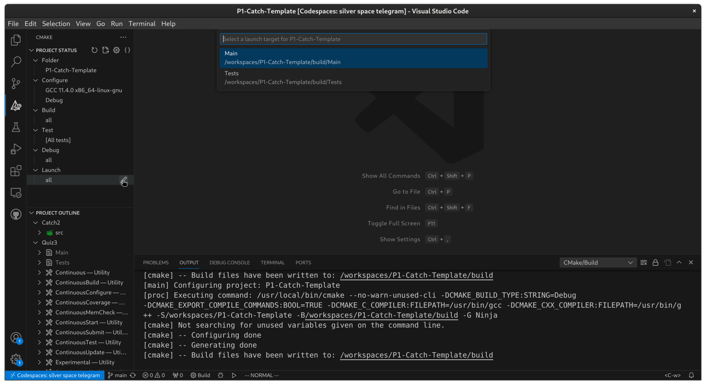
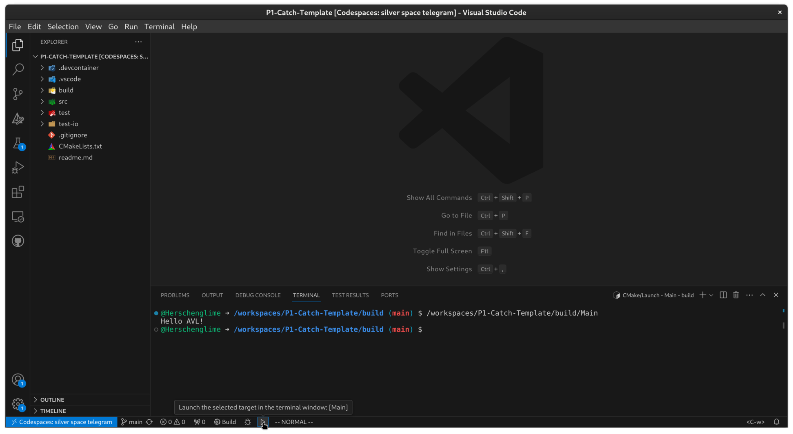
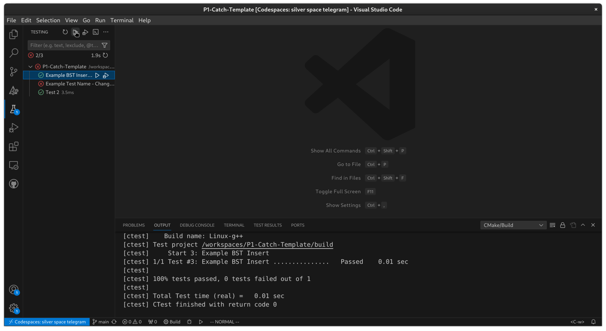
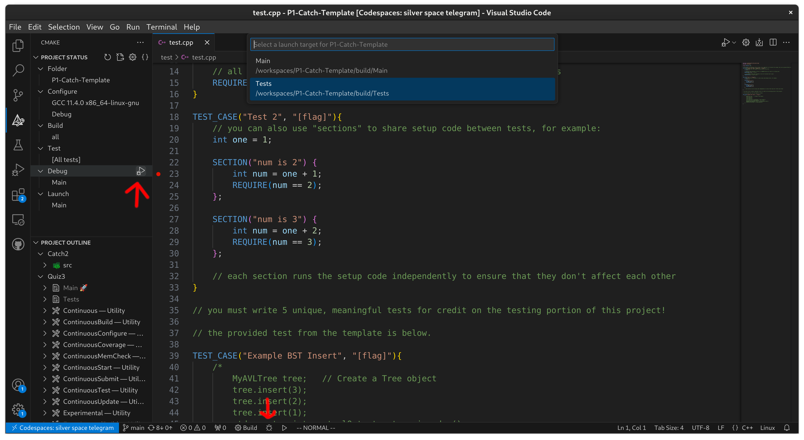
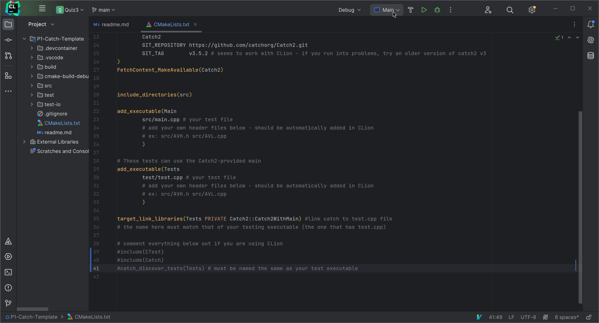
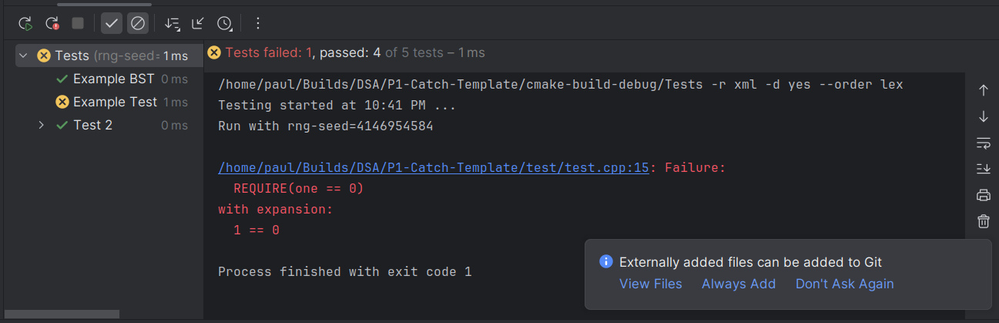

# Completing and Submitting this Assignment

## Video Tutorial
<!-- Setting up embed: -->
<!-- https://ardalis.com/how-to-embed-youtube-video-in-github-readme-markdown/ -->

### Codespaces/VSCode Tutorial
[](https://www.youtube.com/watch?v=R8-glh-Twh4)

### Local CLion Tutorial
[](https://www.youtube.com/watch?v=T6CG9T7nFaA)

**See [the bottom of this document](#common-issues) for common issues and their solutions before asking for help in the Discord!**

## Which method should I choose?

**Method 2 is recommended.**

Method 1 will have you set up with a working programming environment the quickest, and requires no set up on your computer by using cloud containers. You are limited to using VSCode, however, and there is a limit to the amount of time you can spend programming with it, although you are unlikely to run into it. Still, it enables you to work on your project anywhere and on any device, so long as you have a web browser. **This is recommended if you have any issues that you cannot solve when setting the development environment up locally on your computer, but otherwise local development (Method 2) will likely provide a smoother development experience.**

Method 2 takes a bit more work as you might have to install some dependencies, but it enables you to use CLion (which tends to have better C++-specific features) in addition to a local VSCode instance with your preferred settings and extensions. If you want to work on your project on multiple devices, however, you need to make sure to sync your project with Git.

Method 3 is the simplest - it will work with any editor and on any computer so long as you have g++ installed, but you miss out on GUI integration as you have to run your tests and builds from the command line.

## Method 1: Github Codespaces (Easiest)
Provided with this Github page is a Codespaces template that allows you to develop, compile, debug, and test this programming quiz from the cloud, either in your browser or through VSCode on your desktop. It includes a provided installation of Catch2 so that you do not need to install any additional software or libraries to start working. 

To get started, simply click "Use this template" in the top right of the GitHub window, and then select the "Create a new repository" option to make a personal (private!) copy of the template to work in. From there, click the green "Code" button, then click the "Codespaces" tab, and then "Create codespace on main". This will then generate your very own Codespace to work with which operates much the same as VSCode. 

From here, you can either work in your browser, or open your Codespace through VSCode on your desktop and use any extra themes, settings, or extensions you might have installed.

**IMPORTANT: Watch the video if you have trouble running your tests! You must run your tests through the testing tab or CMake tab for VSCode to recognize Catch, *not* the play button in the top right of the editing window!**
See [this link](https://youtu.be/R8-glh-Twh4) for a video tutorial of the above and more detail on using the development environment in case you are unfamiliar with VSCode and CMake.

Note that you get 120 "core hours" per month by default, and 180 with a GitHub Premium account, included with the free [GitHub Student Developer Pack](https://education.github.com/pack). "Core hours" are calculated by multiplying the number of CPU cores in your virtual by the actual number of hours you use the software for. So, with the (perfectly sufficient) 2-core default, you get 60/90 hours of actual use, which should be plenty for this course. 

In the case that you do run out of hours or you simply no longer wish to use Codespaces, as long as you've been regularly committing to your GitHub repo, you can simply clone your work to your local machine and work on it the regular way, detailed below.

## Method 2: Local Development Environment (Preferred)
This is the "regular" way to work on programming quizzes and projects, and lets you use any IDE of your choosing, like CLion (my personal favorite). However, it depends on your local environment having all of the required packages and libraries, namely Git. Instructions are provided below, and you are welcome to ask any TA for help in setting up your computer, but if for whatever reason you are absolutely unable to get the toolchain set up, you should fall back on the Codespaces option, which is guaranteed to work.

Catch2 is automatically pulled in to your project by our CMakeLists.txt configuration, and should require no extra work on your part (given that you have git installed and working).

To get started, make a copy of the template repository the same way you did in Method 1 and then clone your new repository to your computer and open it in your editor of choice (or use its "Get from VCS" feature to open it directly).
<!-- ### Installing Catch2 -->
<!-- The provided CMakeLists.txt build file assumes that you are using Catch2 v3, which has much improved testing speeds over the previous versions. Instructions for installing the library system-wide are provided below, partially adapted from [Catch2's documentation](https://github.com/catchorg/Catch2/blob/devel/docs/tutorial.md). -->

<!-- #### Windows (Currently Untested) -->
<!-- You can use the vcpkg package manager to install the library systemwide. Install instructions for vcpkg are provided [here](docs/cmake-integration.md), but in short, run the following commands from within your project directory: -->

<!-- ```cmd -->
<!-- > git clone https://github.com/microsoft/vcpkg -->
<!-- > .\vcpkg\bootstrap-vcpkg.bat -->
<!-- > .\vcpkg\vcpkg install catch2:x64-windows -->
<!-- ``` -->

<!-- This *should* make Catch2 avaiable to use within your project, but note that I do not have a Windows device to test this on. See the CMake install method below if this doesn't work. -->

<!-- #### MacOS (Also Untested) -->
<!-- Catch2 is available from [homebrew](https://brew.sh/), so making Catch2 available should be as simple as  -->

<!-- ```sh -->
<!-- brew install catch2 -->
<!-- ``` -->

<!-- , given that you have homebrew already installed and set up. -->

<!-- #### Linux -->
<!-- If available, you can install Catch2 with your distro's package manager, although it is likely to be fairly to extremely out of date. If the version is lower than 3, you should install from source like so (make sure you have cmake installed): -->

<!-- ```sh -->
<!-- #catch2 local install source: https://github.com/catchorg/Catch2/issues/1383#issuecomment-421548807 -->
<!-- cd -->
<!-- git clone https://github.com/catchorg/Catch2.git -->
<!-- cd Catch2 -->

<!-- #note that catch needs to be compiled against C++17, see here: https://stackoverflow.com/questions/66227246/catch2-undefined-reference-to-catchstringmaker -->
<!-- cmake -Bbuild -H. -DBUILD_TESTING=OFF -DCMAKE_CXX_STANDARD=17 -->
<!-- sudo cmake --build build/ --target install  -->
<!-- ``` -->

<!-- #### Platform-Independent CMake method -->
<!-- This method requires using CMake features to pull Catch2 in from GitHub and attach it to your project. This method involves changing the provided CMakeLists.txt file. A detailed written and video guide is available [here](https://github.com/COP3530/catch-with-cmake), but note that it is written with Project 1 in mind, so you'll have to translate some of the CMake content to the quiz setup instead.  -->

<!-- This method is more or less guaranteed to work, but takes some time to set up, and you may run into issues along the way. Treat this as a last resort if you can't get any of the easier methods above working for you.  -->

### IDE/Editor Setup

#### CLion
CLion works with Catch2 out of the box and as such requires no extra set up in your environment. Make sure your CLion is as up to date as possible, however, as there have been issues with older versions of CLion and newer versions of Catch 2.

At the bottom of the CMakeLists.txt file are some extra lines of setup code to integrate testing in VSCode. 

```cmake
include(CTest)
include(Catch)
catch_discover_tests(Tests) # must be named the same as your test executable
```

These will cause many more tests to be discovered by CLion than normal, which could cause your run configuration menu to become clogged but will otherwise not affect your project. Comment these lines out before building your project for the first time if using CLion.

See [here](https://github.com/COP3530/catch-with-cmake#part-3-integrating-with-clion) for more detail.

#### VSCode
Make sure that you have the following extensions installed on your VSCode.

- C/C++ (Microsoft)
- C/C++ Extension Pack (Microsoft)
- CMake Tools (Microsoft)
- CMake Language Support (either twxs or Jose Torres)

You must also install CMake itself to your system. CLion bundles a version of CMake with itself so this step is unnecessary if on CLion. Note that the version you install may be older that what CLion would package - if you get an error in your CMakeLists.txt about your CMake being too old, simply change this line

``` cmake
cmake_minimum_required(VERSION 3.24)
```

to have whichever version of CMake that you have installed.

Beyond this setup, the editing/testing process should be the same as outlined in the Codespaces tutorial video. More details are avaiable [here](https://github.com/COP3530/catch-with-cmake#part-3-alternate-integrating-with-vscode), although note that the suggested edits to the CMakeLists.txt file are already present in the template.

#### Visual Studio
This template has also been confirmed working with Visual Studio. Make sure you have the **Desktop Development with C++** "workload" installed ([guide](https://learn.microsoft.com/en-us/cpp/build/vscpp-step-0-installation?view=msvc-170)). Choose the Tests.exe executable from the Run button, and it should pop open a command prompt window with your test results after compiling. Currently I haven't gotten it to integrate with the testing UI yet - if you figure this out, please reach out!

You may run into an error where it says the /Werror flag is unrecognized. If this is the case, remove the `-Werror` flag from line 7 of CMakeLists.txt, like so:
```cmake
set(GCC_COVERAGE_COMPILE_FLAGS "-Wall -Werror")
# becomes
set(GCC_COVERAGE_COMPILE_FLAGS "-Wall")
```

## Method 3: Commandline Testing (Simplest)

In test/test.cpp, replace the line at the top that reads `#include <catch2/catch_test_macros.hpp>` with this line:
```cpp
#include "catch/catch_amalgamated.hpp"
```

Also add includes for your header files with a relative path, like so:
```cpp
#include "../src/AVLTree.h"
```

Run this command once from your project directory:
```sh
g++ -std=c++14 -Werror -Wuninitialized -g -c test/catch/catch_amalgamated.cpp -o build/catch_amalgamated.o
```

Next, run these commands to build and view your tests.
Add any source files (.cpp files) you might need to the command.
Do not add the source file containing the main function.
```sh
g++ -std=c++14 -Werror -Wuninitialized -g build/catch_amalgamated.o test/test.cpp -o build/test
./build/test
```
If you make any changes to your files, you can run the last two commands again.
You do not need to run the first command again.

## Running your Main Executable/Tests
This template provides 2 executables, Main and Tests. Main will run your main.cpp file as it is, while Tests will run Catch tests on your test.cpp and ignore your main.cpp file.

Depending on your editor, you may need to modify the `add_executable()` sections in the CMakeLists.txt file as you add header files that you reference in main. An example is provided within the file. This should be done automatically in CLion.

Choosing the executable differs depending on the editor that you are using. In Clion (and potentially Visual Studio), you should be able to click the dropdown next to the Run button and choose Main or Tests. In VSCode, you should click on the CMake tab in the sidebar, and under Launch, click the edit button to select Main to run your AVL tree.

Please reach out on Discord if you have any questions, and the guide will be updated accordingly.

### VSCode/Codespace
To run main, first enter the CMake tab on the left and select Main as your launch target:


Then to run your main by itself without any tests, click the play button on the bottom of your VSCode window:


To run your tests, navigate to the testing tab as normal, and click the relevant run tests button:


#### Debugging
To debug your either your main or tests, you can place breakpoints as normal. Then, go into the CMake tab and under the debug section, choose whether to debug the Main or Tests target. Press either of the buttons indicated by red arrows to start the debugger for the target you selected.



### CLion
Make sure to comment out the lines at the bottom of `CMakeLists.txt` or you will have *a lot* of possible targets. To select whether to run your main or tests, click the dropdown at the top of the window  and select your desired executable:



From here, if you run the Tests target, you should see your test results appear in a testing window at the bottom of your screen. 



By default, CLion will only show failing tests. Click on the checkmark button in the top of the panel to show passing tests as well.

#### Debugging
Debugging should work as expected. You can also put breakpoints in your catch tests if you desire.

### Common Issues
#### Including main.cpp in your test.cpp file
Catch2 uses its own main function, and as such having your class and function definitions in main.cpp and including them in your test.cpp file **will not work.** To test your code effectively, you should split any code you want to be able to test into a separate `.h` and `.cpp` files. For example, if you put your tree code into `AVL.h` and `AVL.cpp`, the top of your test.cpp would look like:

```cpp
#include <catch2/catch_test_macros.hpp>
#include <iostream>

#include "AVL.h"
```

and the `add_executable()` blocks in `CMakeLists.txt` would look like:
```cpp
add_executable(Main
        src/main.cpp
        src/AVL.h src/AVL.cpp
        )
        
# These tests can use the Catch2-provided main
add_executable(Tests
        test/test.cpp
        src/AVL.h src/AVL.cpp
        )
```

#### `<catch2/catch_test_macros.hpp>` not found in CLion
If you got the template by downloading the zip file from Github and dragging it into Clion, you may have accidentally put the template *inside of* another project instead of opening it as a project itself. To quickly fix this, find the "Open Project" menu item and select the template folder you downloaded as the one for the project. 

An alternative solution would be to copy the template repository following the steps in the instructions and use CLion's "Get From VCS" option to open the project, which would allow you to also keep track of your project changes with git.

#### Empty/Broken main.cpp
For CMake to build your tests, all of the executables need to build successfully. Therefore, if your main.cpp is missing something like a `main()` function or otherwise fails to build, your tests will not successfully build and run either.

#### My code works elsewhere but I'm getting new errors with the template!
The idea behind this template is that you use it and start testing from when you first begin working on your project. That way, you'll be able to address any issues with testing as they come up and be able to ensure that your basic functionality is working before you start writing the more advanced parts of this project.

However, if you just started using this template to run your catch tests, you may run into errors that you didn't see when running your code elsewhere. This is because `CMakeLists.txt` sets the `-Werror` and `-Wall` compiler flags which treats all warnings as errors and increases the number of warnings, respectively. If you don't feel like addressing the cause of the errors, you can safely remove the `-Wall` flag, which should suppress most of the errors. 

However, if you still have errors, you should fix them and leave the `-Werror` flag as it is. This is because Gradescope uses `-Werror` when compiling your project, so if you don't address them now, the autograder will likely fail to successfully build and test your project.

#### My tests fail to run in CLion with an error that looks like the text of my test cases!

This template uses the latest version of Catch2 (3.5.2 as of the writing of this readme). Older versions of CLion can have trouble with later versions of Catch2 v3. These errors can usually be fixed by just updating your CLion. 

If for whatever reason it still doesn't work, you could also try downgrading to a lower version >= 3.0 ([visible from the Catch2 Releases page](https://github.com/catchorg/Catch2/releases)). Edit the GIT_TAG attribute in CMakeLists.txt to change this.

#### Testing input parsing in main.cpp/Testing void functions
If you do your input parsing in `main.cpp`, you will not be able to test those functions in `test.cpp`. The easiest solution would be to simply move that functionality into a method that you either include in your Tree class or in a separate Parser class, but other solutions could also work.

Similarly, you may run into trouble if you made all of your tree functions output to console but return void. The easiest way to solve this would be to simply make those functions return some testable datatype like a string or a vector that you can verify in your Catch tests. Alternatively, you could follow the structure of [this link](https://stackoverflow.com/a/4191318) to capture and test console output, but this is more complex.

#### Testing private methods
You may want to test helper methods in your AVL class that are declared as private. By default, Catch testing can't see private methods because it uses regular C++ class access, but there is a workaround that you can use to make these private functions visible to Catch while still keeping proper access declarations in your actual code (which we grade). Consider the following:

```cpp
#include <catch2/catch_test_macros.hpp>
#include <iostream>

#define private public

#include "AVL.h"
```

This *preprocessor directive* will replace every instance of the word "private" with "public" in the included files that follow the declaration. This has the effect of turning all of your private methods into public ones that Catch2 can see, but only in your test.cpp. There are a couple things keep in mind if you choose to do this, however:

1. This directive will only replace "private" with "public" if the word is actually present, so if you make use of the fact that a class's properties and function definitions are private by default without having to write `private:`, you'll need to go back into your header and explicitly write the access modifier for this to work.
2. Depending on what standard library headers you use, this change could break their functionality. To get around this, you can either:
   1. (Simpler) Include whatever system headers you use in your code in `test.cpp` *above* the `#define public private` line. This causes the compiler to include the relevant headers *before* redefining the `private` keyword, and once the `#include` blocks inside of your `AVL.h` headers are reached, the system headers won't be included again due to the `#pragma once` or `#ifndef` directives preventing a multiple definition error in the headers.
   2. (More advanced) Using another `#define` directive, define a "debug" flag (`#define debug`) in your `test.cpp` and remove `#define public private`. Then, put a
      ```cpp
      #ifdef debug 
      #define public private
      #endif
      ```
   segment in each of the files you want to test *after* you include system headers. That way, upon compiling test.cpp, the "debug" flag will be defined, which will then cause the access modifiers to be changed in every file that you put the `#ifdef` block in.
